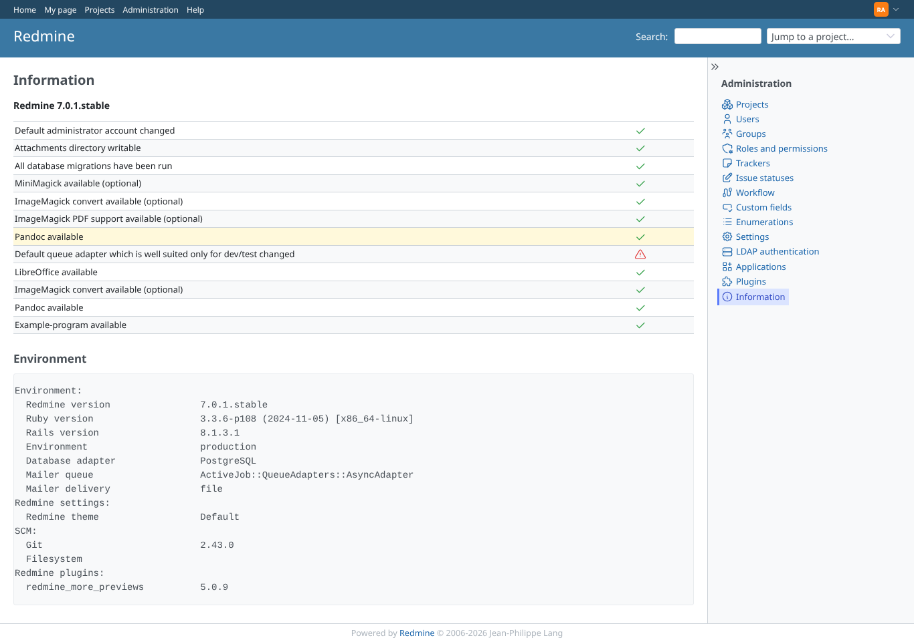

# admin_info

Run 2026-10-07T16:56:07.699Z against http://127.0.0.1:3000.

| screenshot | user | URL | shows |
|---|---|---|---|
|  | admin | `/admin/info` | Administration > Information: the converter checks (pandoc, LibreOffice, ImageMagick ...) next to core's own, with SVG check icons |
|  | manager | `/admin/info` | Not for non-admins (403) |
