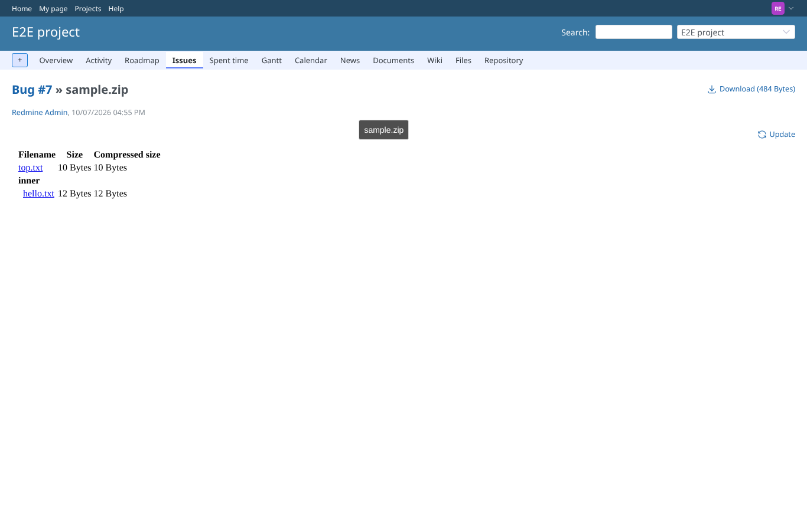
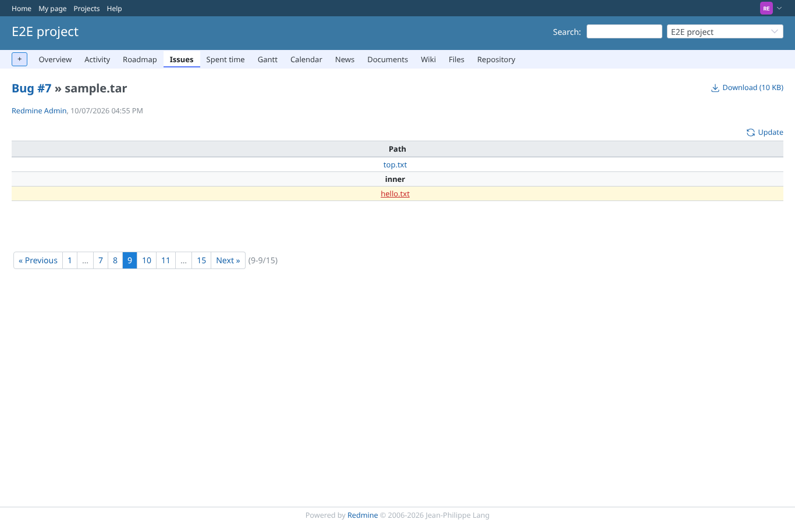
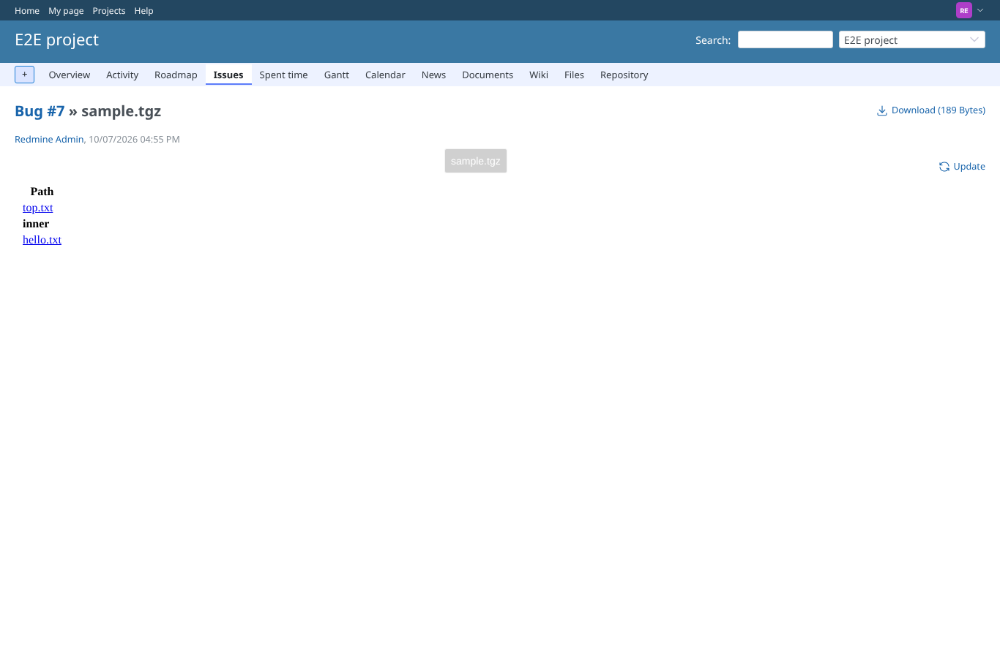

# archives

Run 2026-10-07T16:56:11.752Z against http://127.0.0.1:3000.

| screenshot | user | URL | shows |
|---|---|---|---|
|  | reporter | `/attachments/16` | Zip listing with the folder "inner"; clicking inner/hello.txt in the sandboxed preview downloads "hello inner" (was an empty file before this branch) |
|  | reporter | `/attachments/10` | Tar listing rendered inline; inner/hello.txt downloads its content |
|  | reporter | `/attachments/12` | Tgz listing; top.txt and inner/hello.txt served as downloads with their content (checked through their URLs) |
