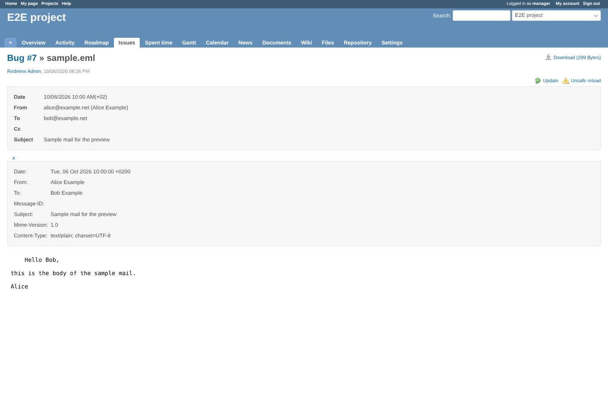
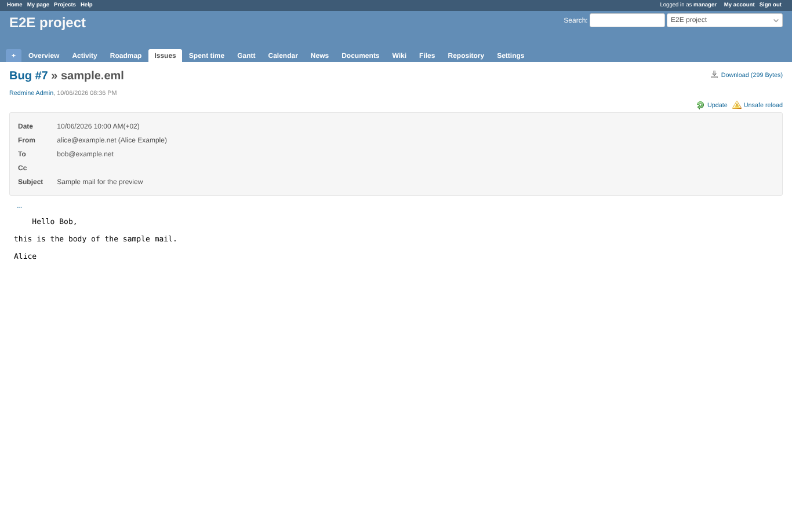
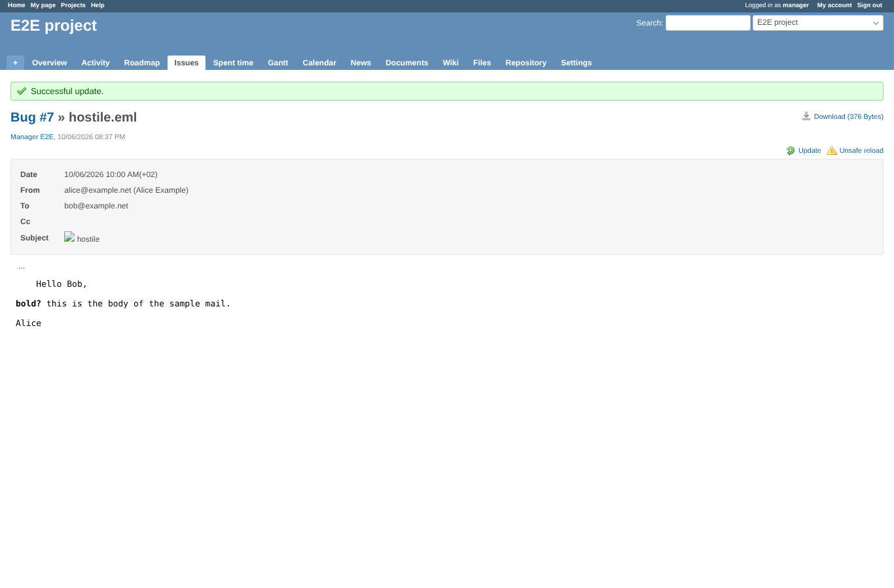

# mail

Run 2026-10-06T20:37:50.552Z against http://127.0.0.1:3000.

| screenshot | user | URL | shows |
|---|---|---|---|
|  | manager | `/attachments/4` | Mail preview: header box, all header fields opened with "...", the body below; Update and Unsafe reload with their icons |
|  | manager | `/attachments/4?reload=1&unsafe=1` | "Unsafe reload" converts the mail again without the cache |
|  | manager | `/attachments/18` | A mail with  in the subject and <script> in the body: both shown as text, nothing runs (the page title stays) |

## Problems

- /attachments/4 as manager: JS e.indexOf is not a function
- unsafe reload as manager: JS e.indexOf is not a function
- /attachments/18 as manager: JS e.indexOf is not a function
- /attachments/18 as manager: 404 image /attachments/x
- hostile mail ran its script
- img onerror in the page
- body tags not shown as text
