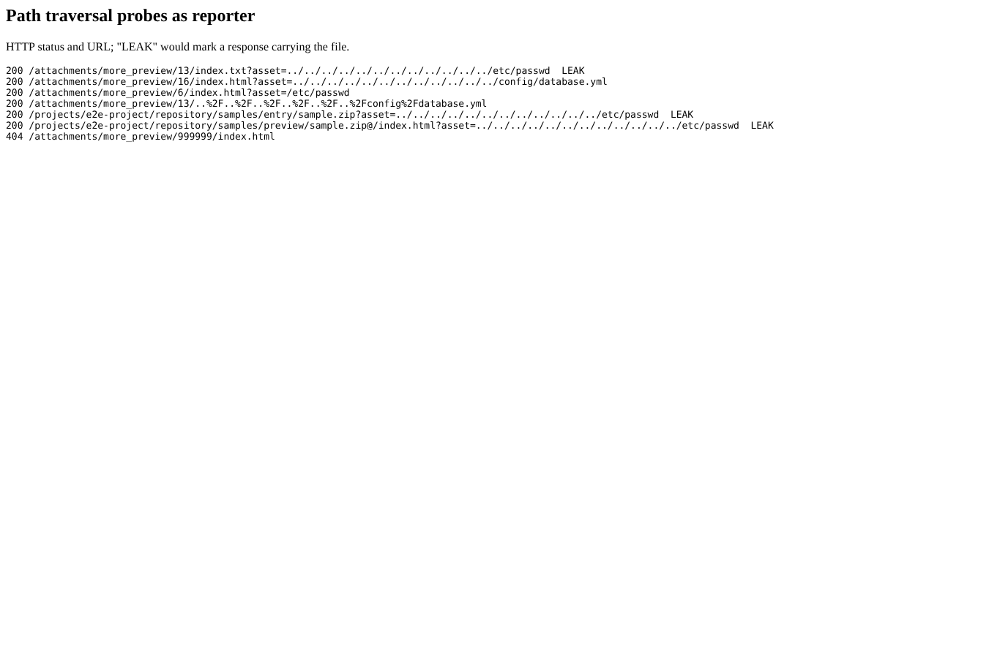

# security

Run 2026-10-06T20:40:35.493Z against http://127.0.0.1:3000.

| screenshot | user | URL | shows |
|---|---|---|---|
|  | reporter | `/my/page` | Assets outside the preview directory are refused with 404 (before this branch /etc/passwd and config/database.yml came back with 200) |
|  | reporter | `/attachments/more_preview/5/index.html` | An HTML preview opened directly: rendered, but with "Content-Security-Policy: " (no script, opaque origin) |

## Problems

- /attachments/more_preview/13/index.txt?asset=../../../../../../../../../../../../etc/passwd: HTTP 200 and the file content
- /attachments/more_preview/16/index.html?asset=../../../../../../../../../../../../config/database.yml: HTTP 200
- /attachments/more_preview/6/index.html?asset=/etc/passwd: HTTP 200
- /attachments/more_preview/13/..%2F..%2F..%2F..%2F..%2F..%2Fconfig%2Fdatabase.yml: HTTP 200
- /projects/e2e-project/repository/samples/entry/sample.zip?asset=../../../../../../../../../../../../etc/passwd: HTTP 200 and the file content
- /projects/e2e-project/repository/samples/preview/sample.zip@/index.html?asset=../../../../../../../../../../../../etc/passwd: HTTP 200 and the file content
- traversal in the browser: page.goto: Download is starting (the file is served)
- html preview CSP: ""
