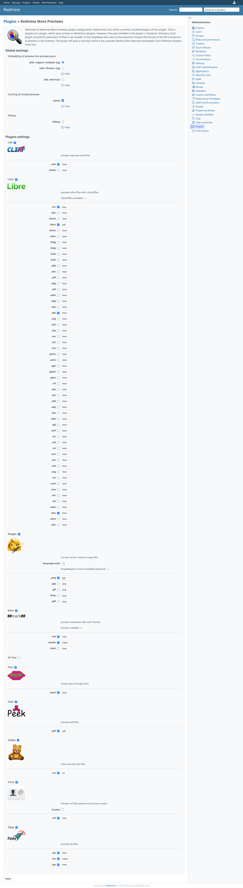
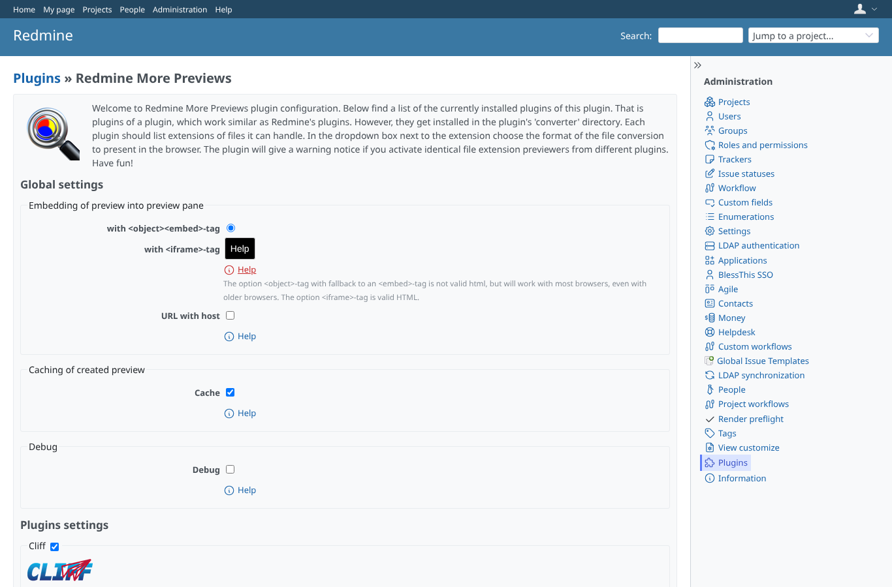
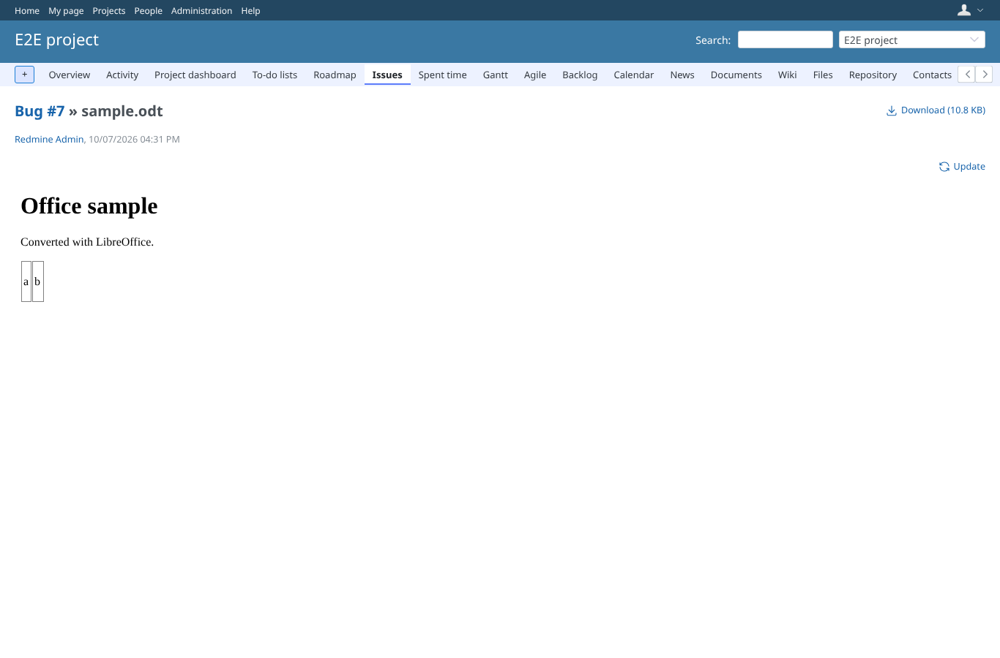
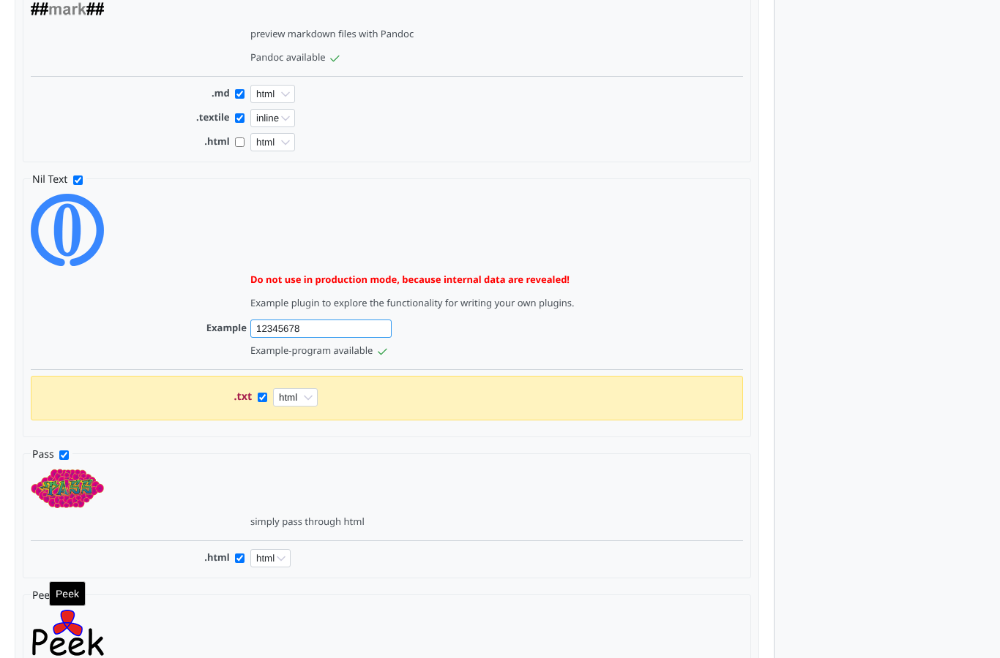

# settings

Run 2026-10-07T16:50:57.829Z against http://127.0.0.1:3000.

| screenshot | user | URL | shows |
|---|---|---|---|
|  | admin | `/settings/plugin/redmine_more_previews` | Settings: global options, then one box per converter with its logo, program check (pandoc, LibreOffice ... available, SVG icon) and file types |
|  | admin | `/settings/plugin/redmine_more_previews` | The help link (SVG icon) opens the explanation of the embedding option |
|  | admin | `/attachments/7` | With <iframe> embedding and the cache off the odt is converted on every request and shown; the loading indicator is hidden on load (jQuery 3 .on("load"), no JS error) |
|  | admin | `/settings/plugin/redmine_more_previews` | .txt active in both Nil Text and Teddie: the row is marked as a warning |
|  | manager | `/settings/plugin/redmine_more_previews` | A non-admin (manager) gets 403 on the plugin settings |
|  | anonymous | `/login?back_url=http%3A%2F%2F127.0.0.1%3A3000%2Fsettings%2Fplugin%2Fredmine_more_previews` | Anonymous is sent to the login page |
