# core_handover

Run 2026-10-07T16:57:47.158Z against http://127.0.0.1:3000.

| screenshot | user | URL | shows |
|---|---|---|---|
| 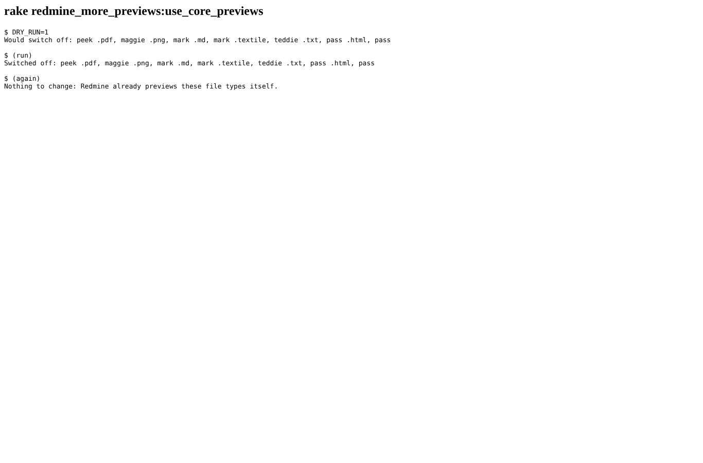 | anonymous | `about:blank` | The rake task: dry run lists, the run switches off exactly pdf, images, txt, md, textile, html and the pass converter, a second run changes nothing |
| 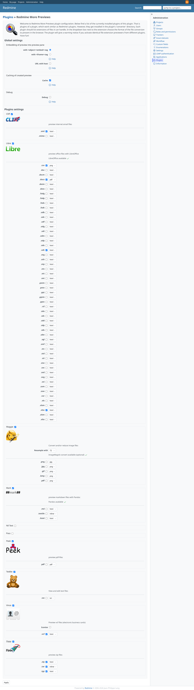 | admin | `/settings/plugin/redmine_more_previews` | Plugin settings after the task: Pass off, Mark .md/.textile/.html off, Peek, Maggie and Teddie off; Libre, Cliff, Zippy, Vince unchanged |
| 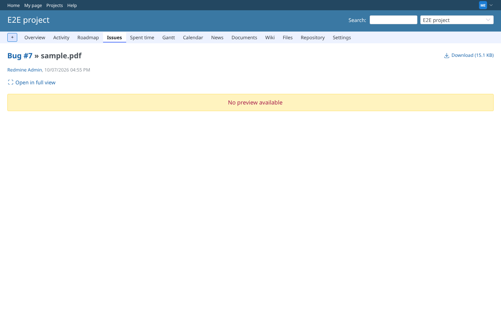 | manager | `/attachments/8` | manager: sample.pdf shown by Redmine 7 itself (a PDF: headless Chromium has no PDF viewer, so core shows its fallback text and the plugin "Couldn't load plugin") |
| 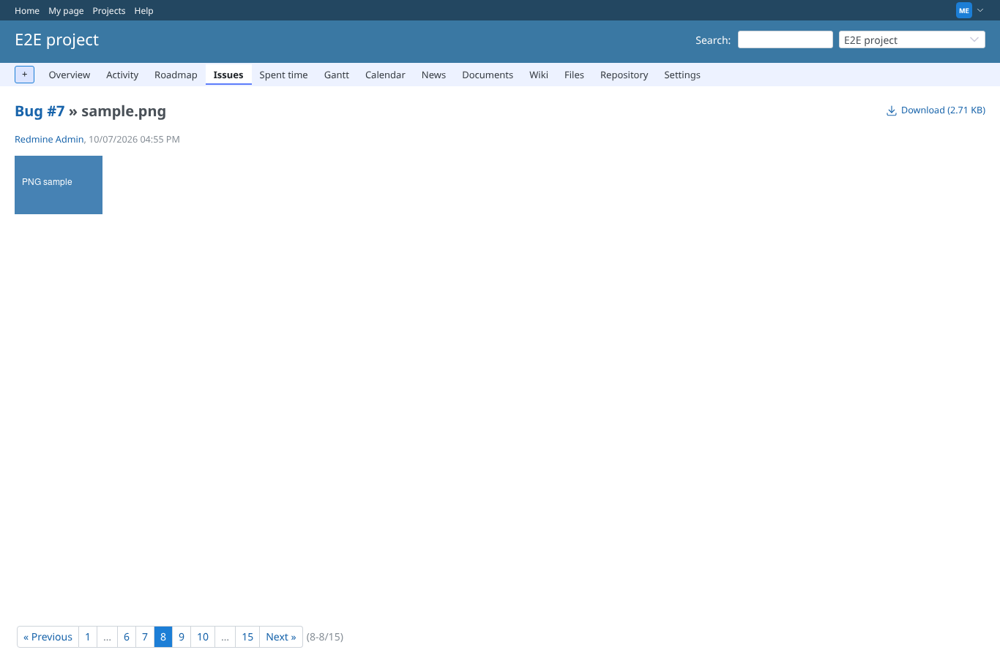 | manager | `/attachments/9` | manager: sample.png shown by Redmine 7 itself |
| 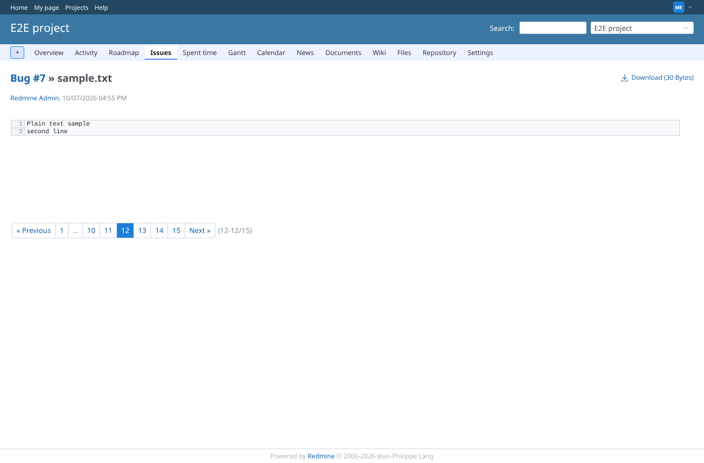 | manager | `/attachments/13` | manager: sample.txt shown by Redmine 7 itself |
| 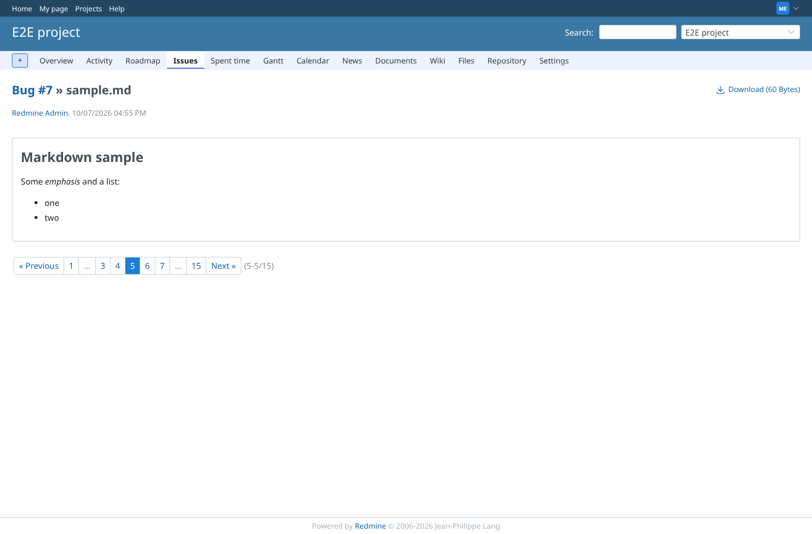 | manager | `/attachments/6` | manager: sample.md shown by Redmine 7 itself |
| 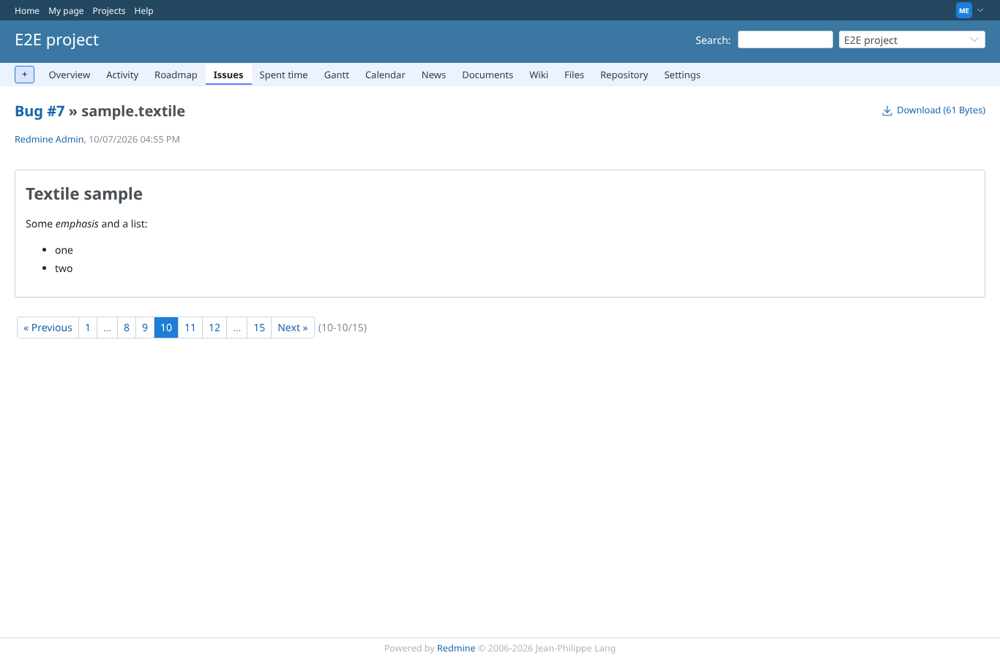 | manager | `/attachments/11` | manager: sample.textile shown by Redmine 7 itself |
| 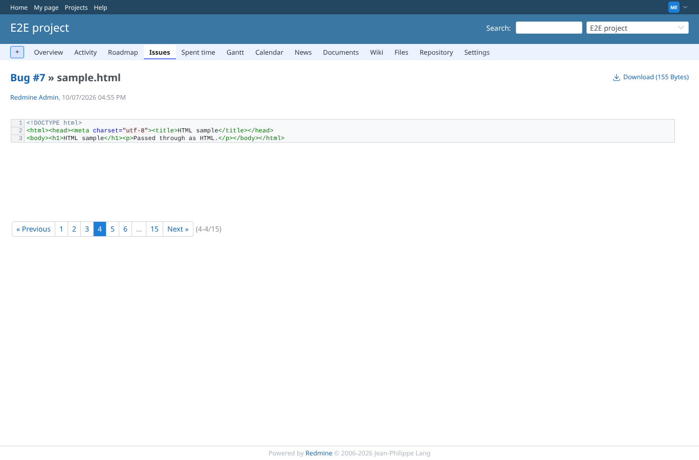 | manager | `/attachments/5` | manager: sample.html shown by Redmine 7 itself |
| 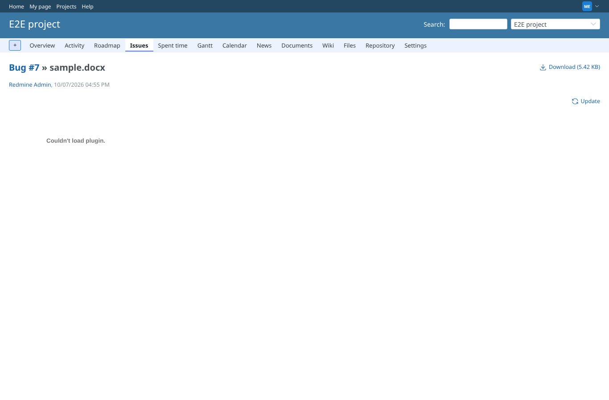 | manager | `/attachments/3` | manager: sample.docx still shown by the plugin (a PDF: headless Chromium has no PDF viewer, so core shows its fallback text and the plugin "Couldn't load plugin") |
| 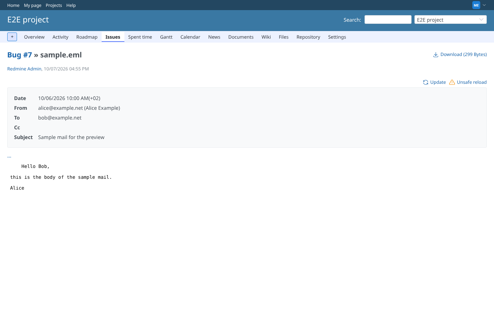 | manager | `/attachments/4` | manager: sample.eml still shown by the plugin |
| 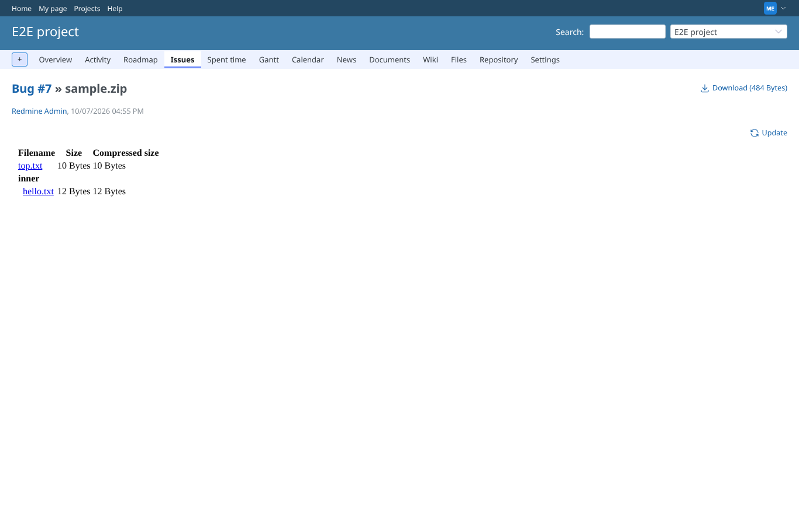 | manager | `/attachments/16` | manager: sample.zip still shown by the plugin |
| 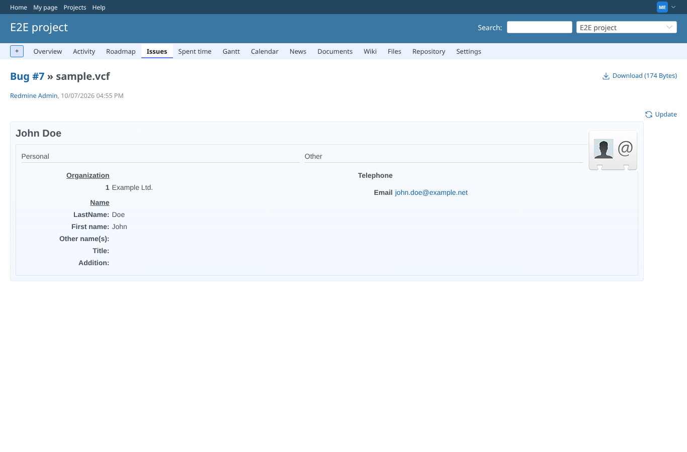 | manager | `/attachments/14` | manager: sample.vcf still shown by the plugin |
| 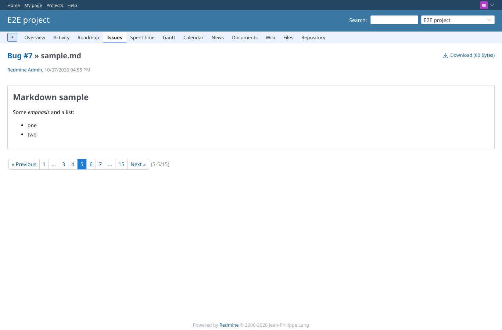 | reporter | `/attachments/6` | reporter: sample.md shown by Redmine 7 itself |
| 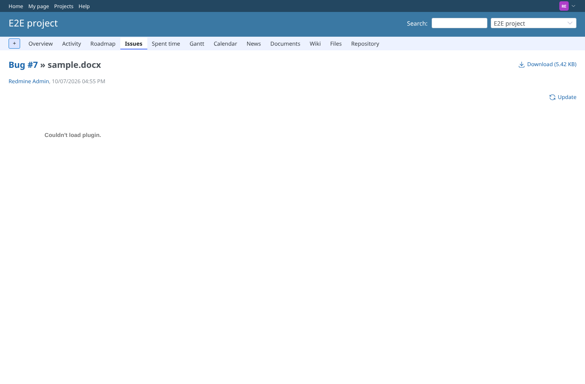 | reporter | `/attachments/3` | reporter: sample.docx still shown by the plugin (a PDF: headless Chromium has no PDF viewer, so core shows its fallback text and the plugin "Couldn't load plugin") |
|  | outsider | `/attachments/17` | Outsider on the private project: still 403 (core preview now) |
|  | outsider | `/settings/plugin/redmine_more_previews` | Non-admin on the plugin settings: 403 |
