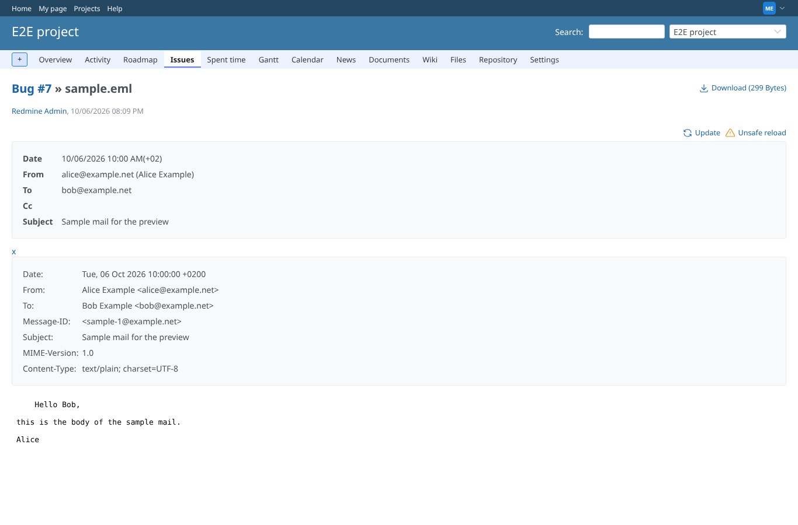
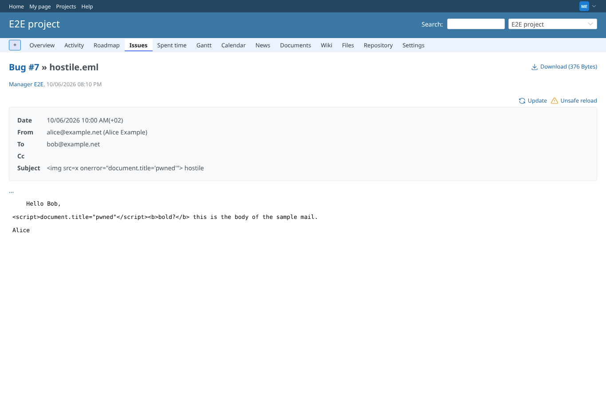

# mail

Run 2026-10-06T20:11:01.383Z against http://127.0.0.1:3000.

| screenshot | user | URL | shows |
|---|---|---|---|
|  | manager | `/attachments/4` | Mail preview: header box, all header fields opened with "...", the body below; Update and Unsafe reload with their icons |
|  | manager | `/attachments/4?reload=1&unsafe=1` | "Unsafe reload" converts the mail again without the cache |
|  | manager | `/attachments/18` | A mail with  in the subject and <script> in the body: both shown as text, nothing runs (the page title stays) |
