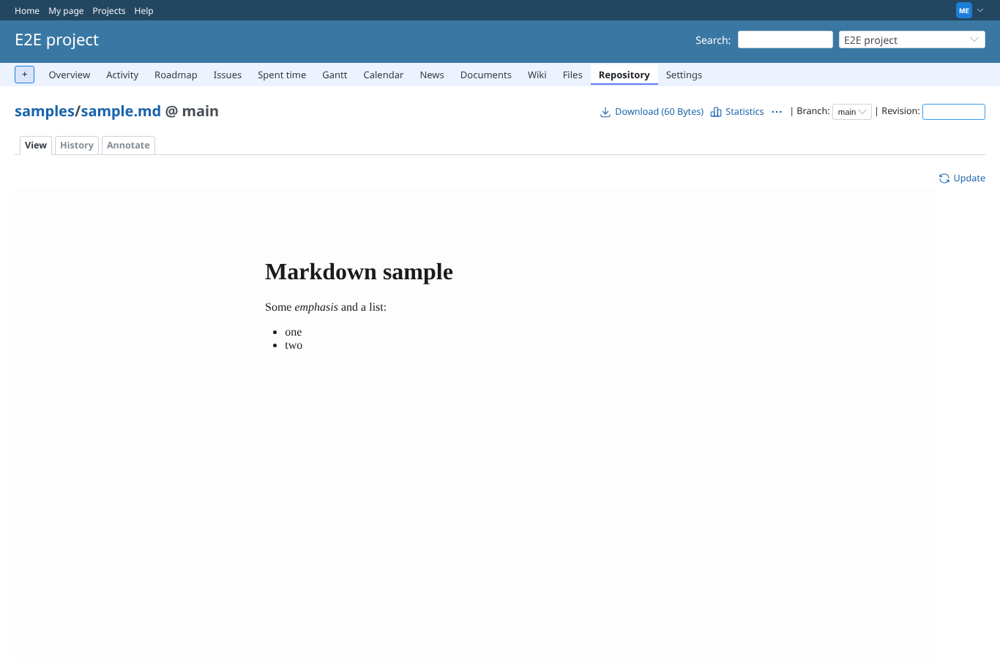
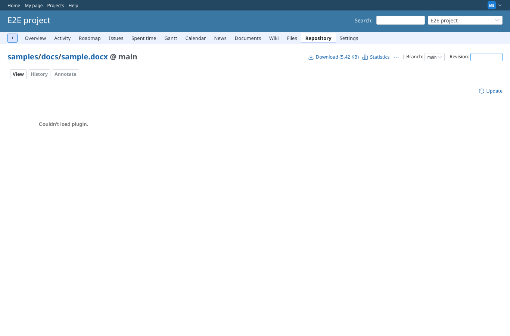
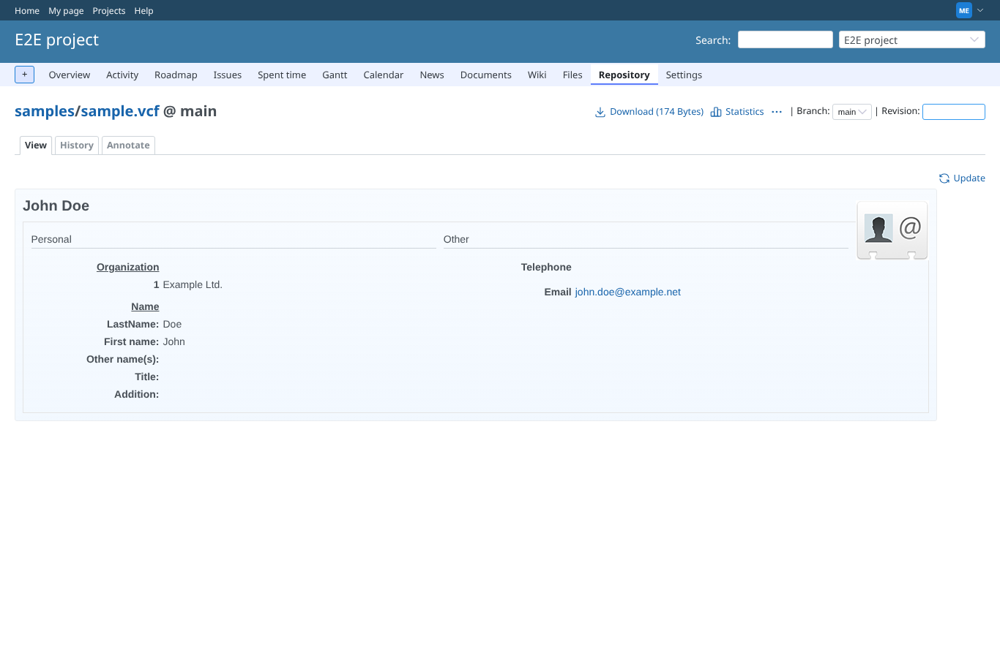
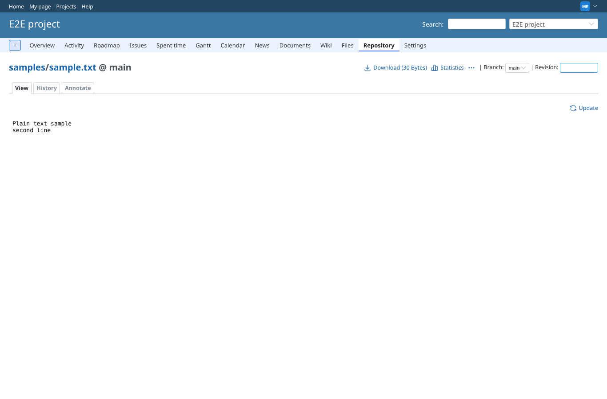
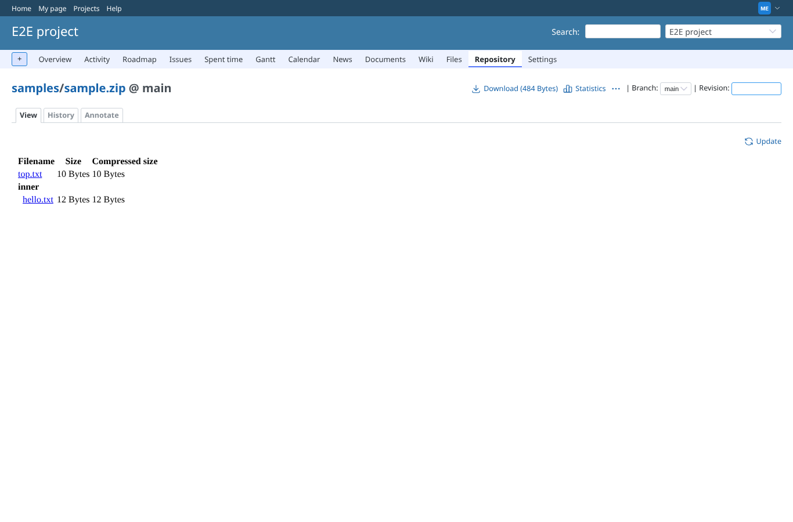
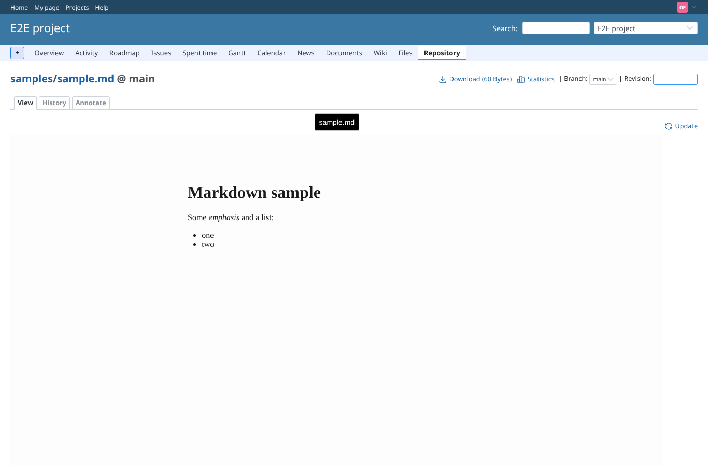

# repository

Run 2026-10-06T20:16:22.127Z against http://127.0.0.1:3000.

| screenshot | user | URL | shows |
|---|---|---|---|
|  | manager | `/projects/e2e-project/repository/samples/entry/sample.md` | Markdown file in the repository, converted by Mark |
|  | manager | `/projects/e2e-project/repository/samples/entry/docs/sample.docx` | docx in a folder of the repository, converted to PDF by LibreOffice (no PDF viewer in headless Chromium; checked through its URL) |
|  | manager | `/projects/e2e-project/repository/samples/entry/sample.vcf` | vcard in the repository |
|  | manager | `/projects/e2e-project/repository/samples/entry/sample.txt` | Text file in the repository (Teddie) |
|  | manager | `/projects/e2e-project/repository/samples/entry/sample.zip` | Zip in the repository: its files are listed (the preview was empty before this branch) |
|  | outsider | `/projects/e2e-project/repository/samples/entry/sample.md` | Outsider on the public project (non-member role) can browse and preview the repository like core allows |
