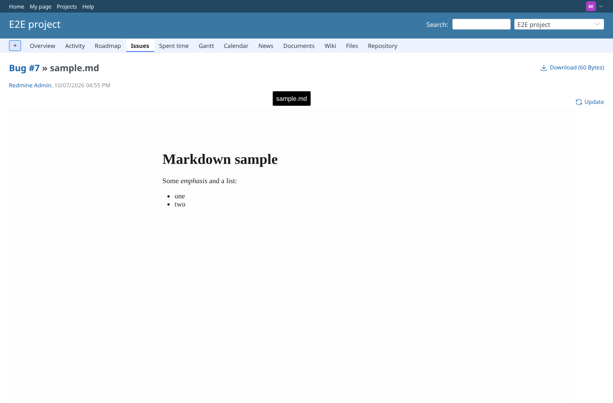
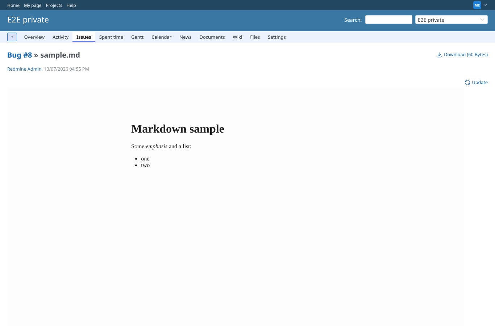
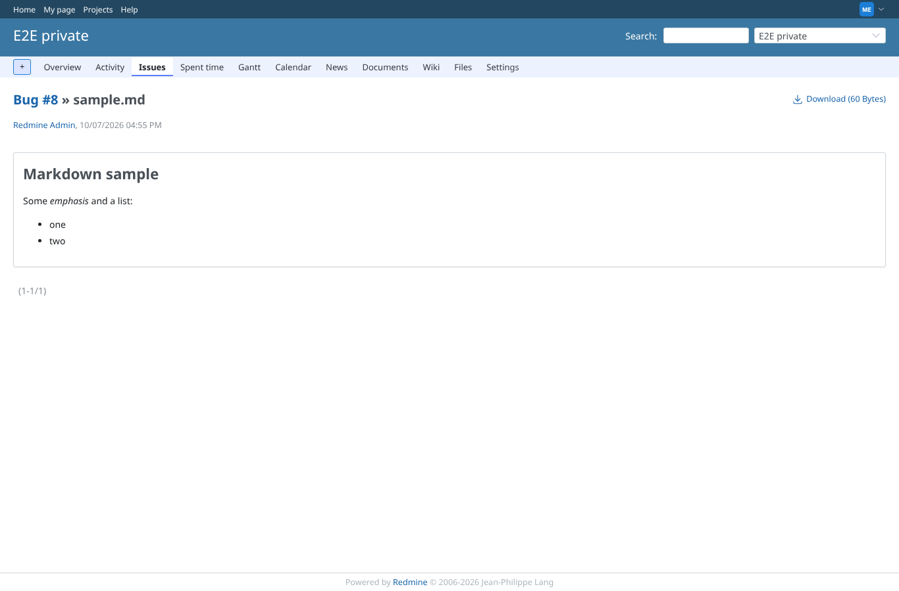
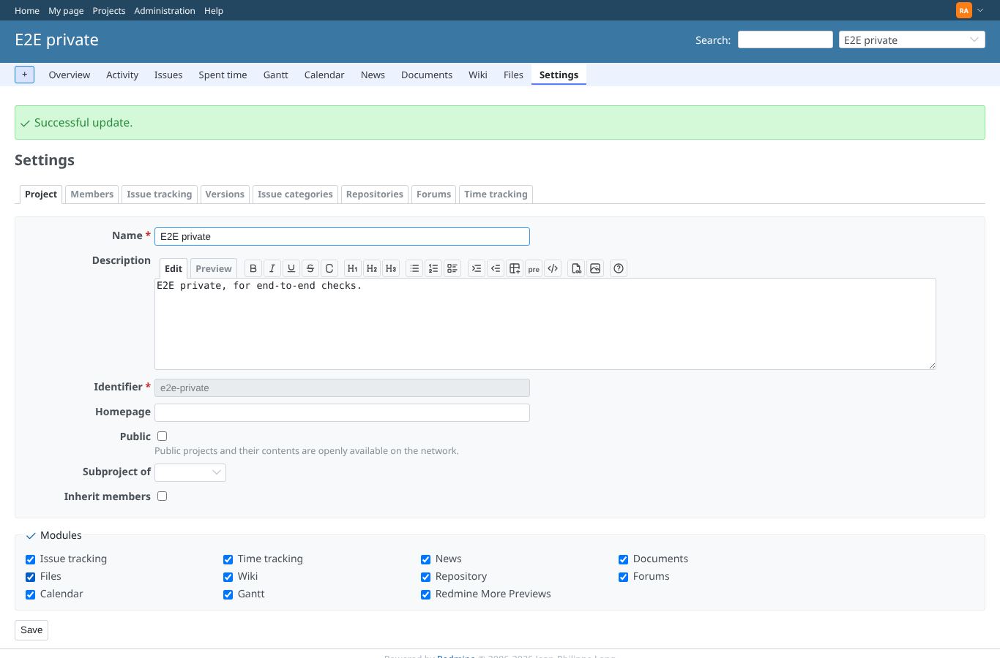

# permissions

Run 2026-10-07T16:58:09.339Z against http://127.0.0.1:3000.

| screenshot | user | URL | shows |
|---|---|---|---|
|  | reporter | `/attachments/6` | Reporter (core role, no extra permissions) sees the markdown preview: the plugin permission is public |
|  | manager | `/attachments/17` | Manager, member of the private project, sees the preview there |
|  | outsider | `/attachments/17` | Outsider (no membership): the private attachment is refused (403) |
|  | anonymous | `/login?back_url=http%3A%2F%2F127.0.0.1%3A3000%2Fattachments%2F17` | Anonymous on the private attachment is sent to the login |
|  | manager | `/attachments/17` | Module "Redmine More Previews" off in the private project: Redmine 7 shows its own markdown preview |
|  | admin | `/projects/e2e-private/settings` | Module switched on again in the project settings (admin) |
