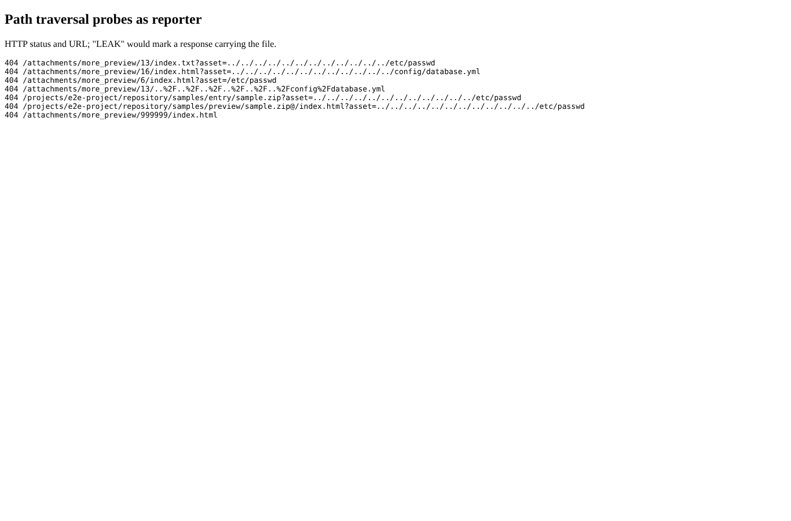
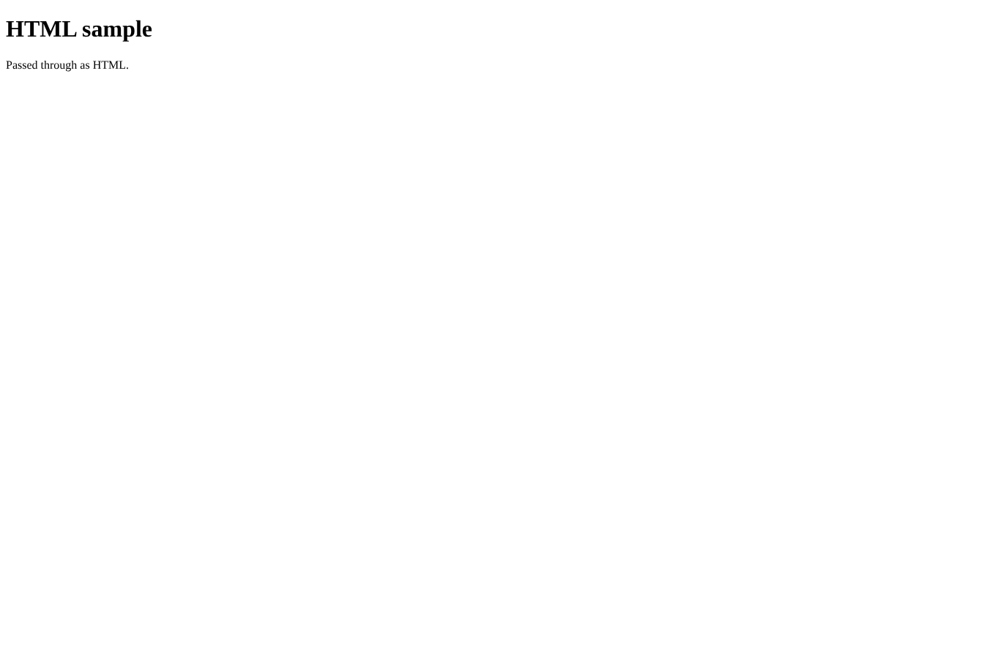

# security

Run 2026-10-06T20:11:42.391Z against http://127.0.0.1:3000.

| screenshot | user | URL | shows |
|---|---|---|---|
|  | reporter | `/attachments/more_preview/13/index.txt?asset=../../../../../../../../../../../../etc/passwd` | Assets outside the preview directory are refused with 404 (before this branch /etc/passwd and config/database.yml came back with 200) |
|  | reporter | `/attachments/more_preview/5/index.html` | An HTML preview opened directly: rendered, but with "Content-Security-Policy: sandbox allow-downloads allow-popups allow-popups-to-escape-sandbox" (no script, opaque origin) |
