# smoke

Run 2026-10-07T16:55:53.966Z against http://127.0.0.1:3000.

| screenshot | user | URL | shows |
|---|---|---|---|
|  | admin | `/` | / (HTTP 200) |
| 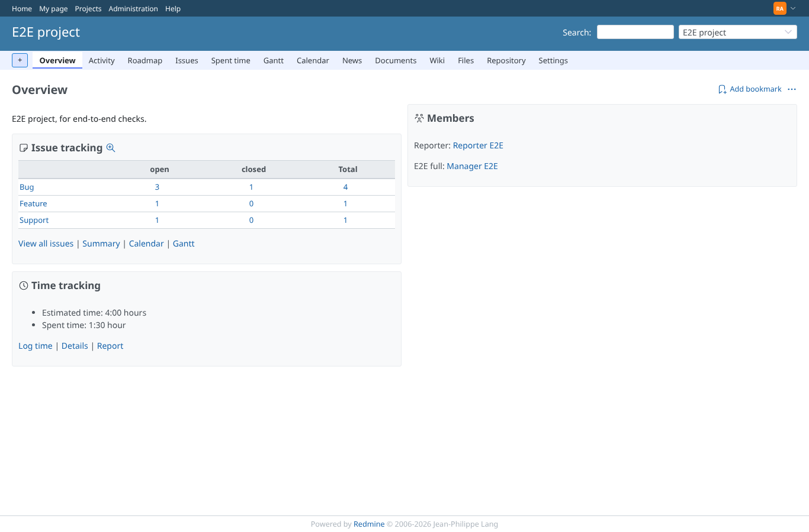 | admin | `/projects/e2e-project` | /projects/e2e-project (HTTP 200) |
| 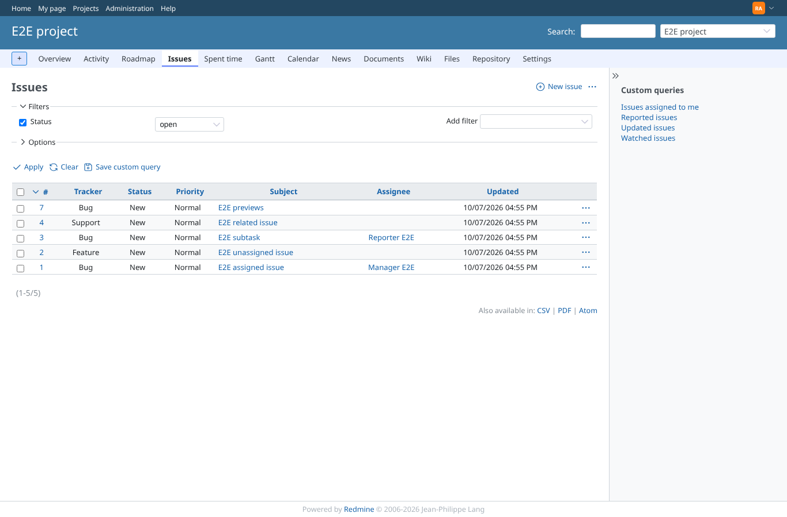 | admin | `/projects/e2e-project/issues` | /projects/e2e-project/issues (HTTP 200) |
| 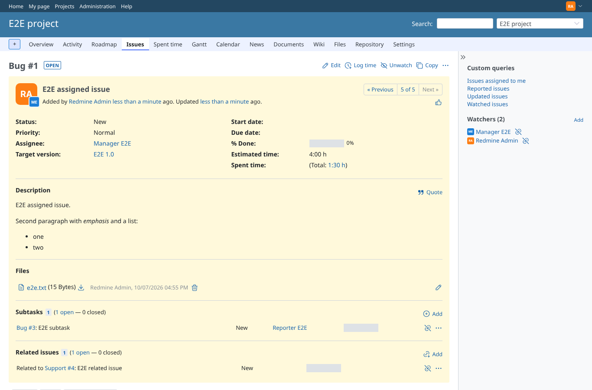 | admin | `/issues/1` | /issues/1 (HTTP 200) |
| 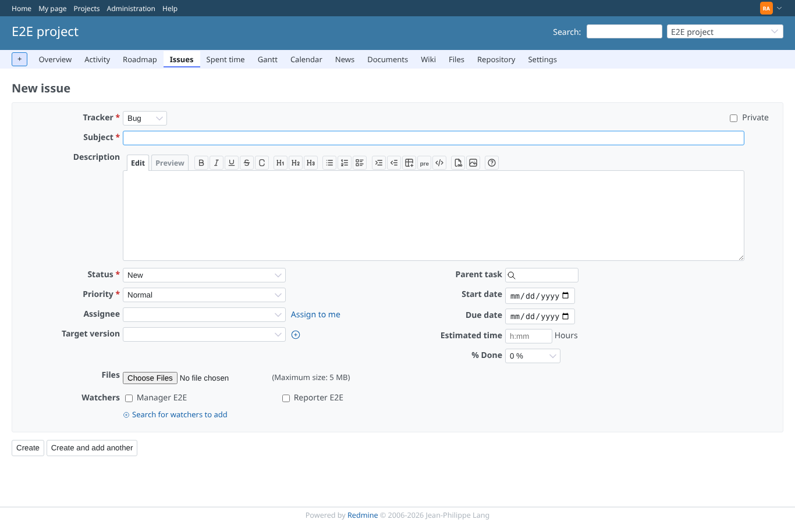 | admin | `/projects/e2e-project/issues/new` | /projects/e2e-project/issues/new (HTTP 200) |
| 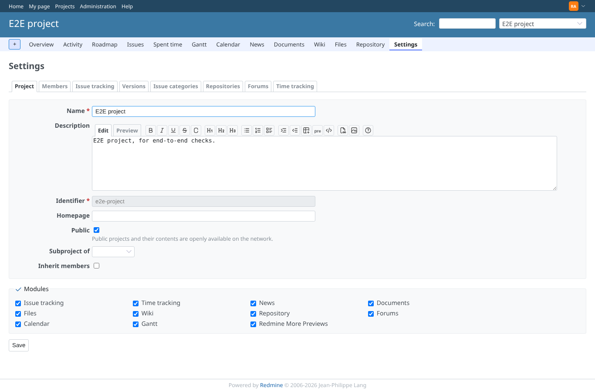 | admin | `/projects/e2e-project/settings` | /projects/e2e-project/settings (HTTP 200) |
| 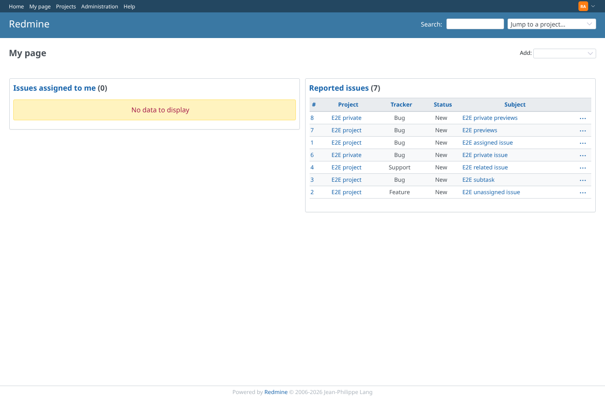 | admin | `/my/page` | /my/page (HTTP 200) |
| 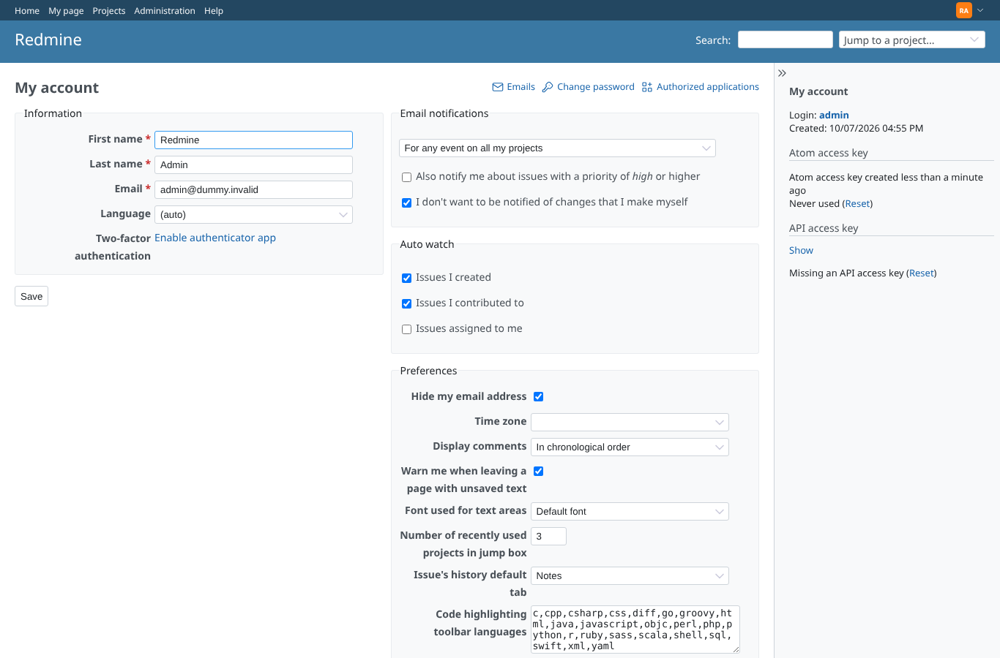 | admin | `/my/account` | /my/account (HTTP 200) |
|  | admin | `/admin` | /admin (HTTP 200) |
| 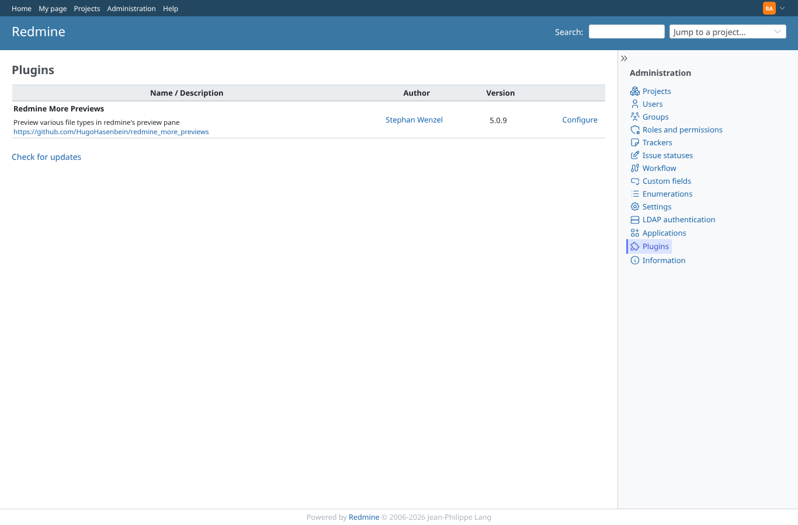 | admin | `/admin/plugins` | /admin/plugins (HTTP 200) |
| 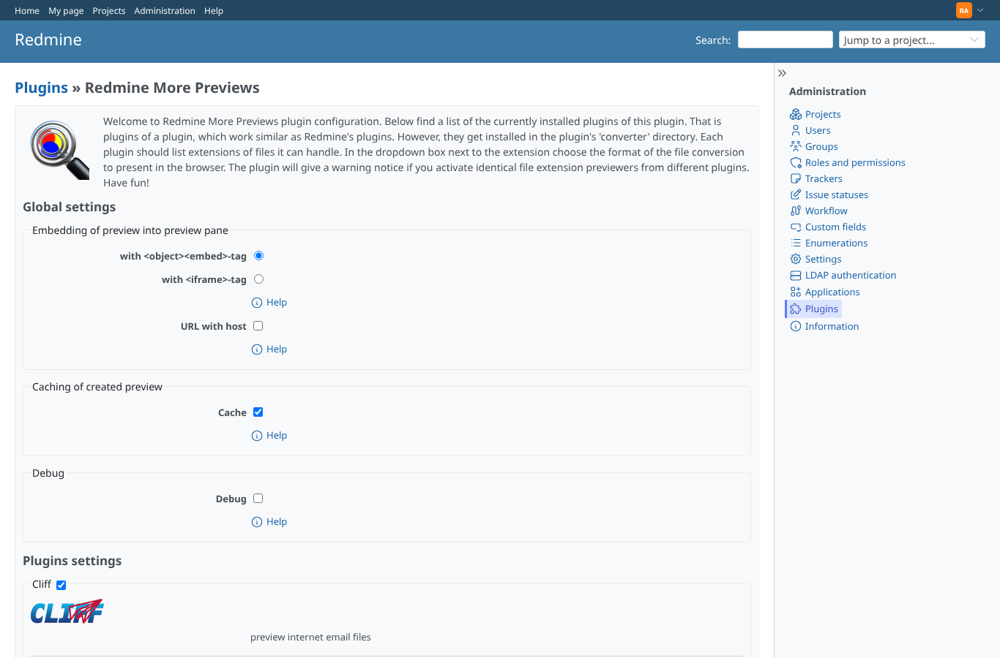 | admin | `/settings/plugin/redmine_more_previews` | /settings/plugin/redmine_more_previews (HTTP 200) |
| 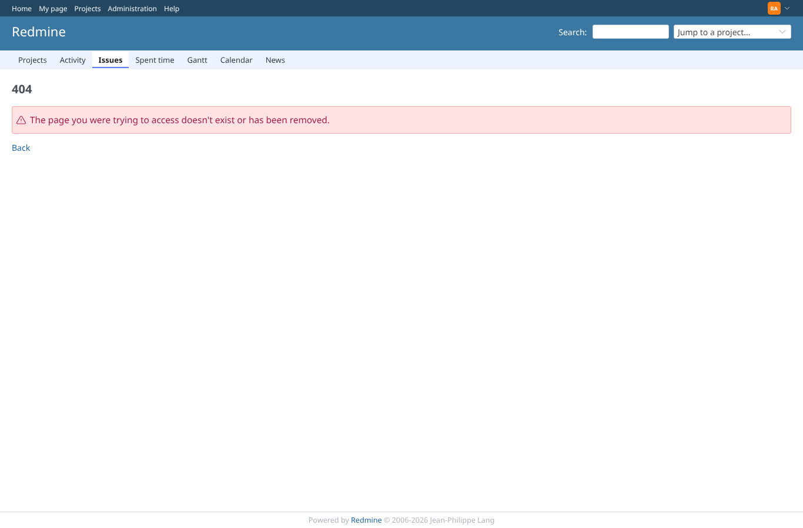 | admin | `/attachments/1/1` | /attachments/1/1 (HTTP 404) |
| 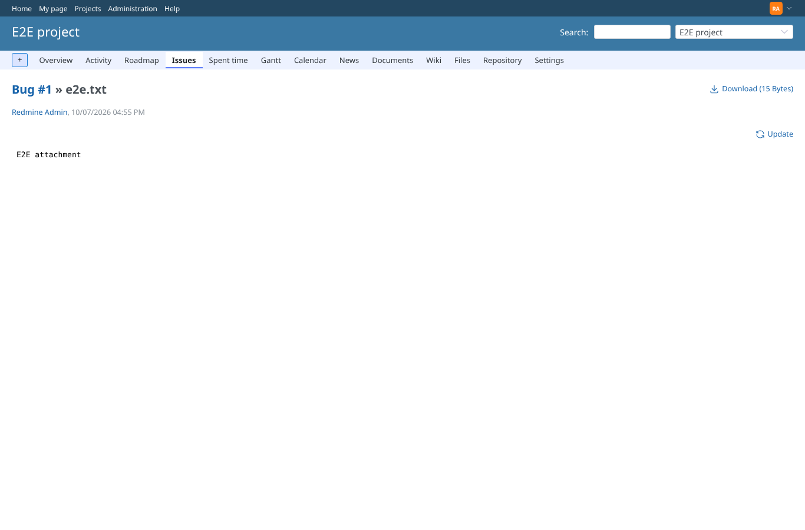 | admin | `/attachments/1` | /attachments/1 (HTTP 200) |
| 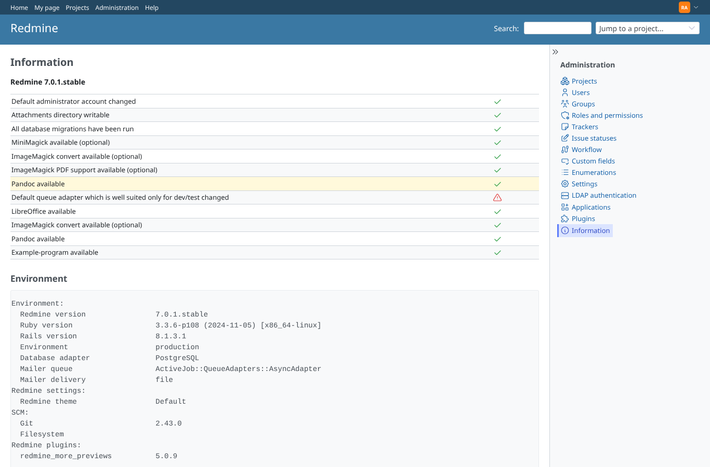 | admin | `/admin/info` | /admin/info (HTTP 200) |
| 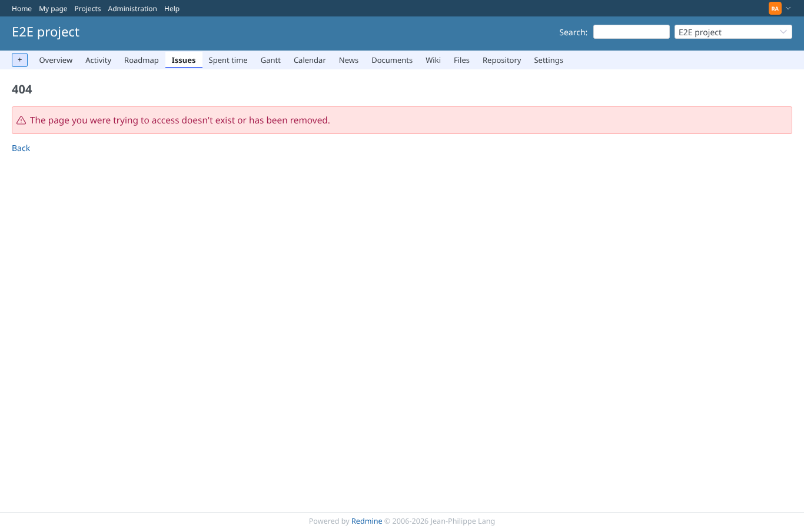 | admin | `/attachments/more_preview/1/index` | /attachments/more_preview/1/index (HTTP 404) |
